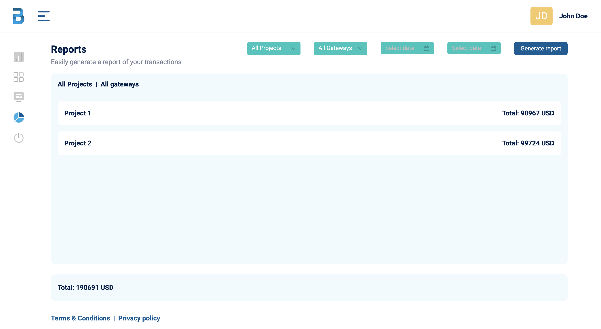

# Reporta

## Finance Report generator


> **Reporta** allows you to do the following

- [x] Fetch All Projects Report.
- [x] Fetch All Gateways Report.
- [x] View reports of single project.
- [x] View reports of single gateway.
- [x] Generate report in a simple Doughnut Chart.

**Note**: **I have a deployed version of the aplication found [here on Heroku](http://reporta.herokuapp.com)**

## Images

<details>
<summary>Here are samples.</summary>




</details>

## Built With

- [React](https://reactjs.org)
- [Redux](https://redux-toolkit.js.org/)
- [d3](https://github.com/d3/d3)

## Getting Started

Foremost, you have to clone this repository and install all the dependencies with the following commands.

```bash
git clone https://github.com/Samtaylek17/mvpmatch.git
cd Reporta
npm install

```

Rename the `.env.example` to `.env` and customize it to your local machines specifications.

Run the following command to start the project

```bash
  npm start
```

## Authors

**[Temitayo Ogunsusi](https://github.com/samtaylek17/)**
